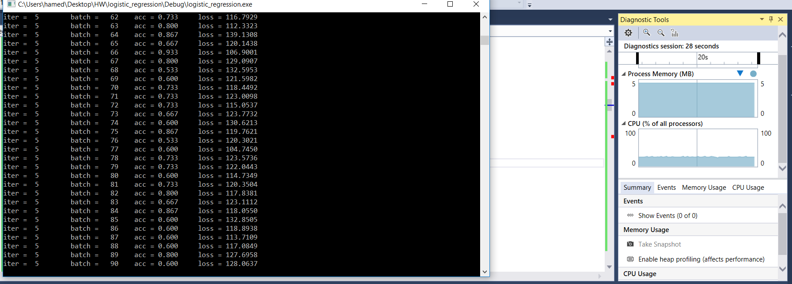

# digits_regression
Handwritten Digits classification with C++

# Gaol
Classification of handwritten digits using a single layer neural network.

# [Dataset](http://scikit-learn.org/stable/modules/generated/sklearn.datasets.load_digits.html)
The total number of samples is 1797 and each sample has 64 values between 0 and 16, and a label from 0 to 9. I normalized all the input 
values to [-1,1].

# Architecture
The network has 64 input units, and 10 units in the output layer. Each unit in the last layer represents one class. Therefore, we have
64x10 weights and 10 biases. The activation function is sigmoid and the loss function is MSE: 0.5 Sigma(y-y_hat)^2.

# Results
* Average train accuracy over all the batches is around 72% (varies for different batch size and epochs).
* Test accuracy is around 75%. Since batch size is small, the train accuracy fluctuates a lot and that's why the "average" train accuracy
is smalled than test accuracy.

# Memory Usage

# IDE
* Microsoft Visual Studio ce
